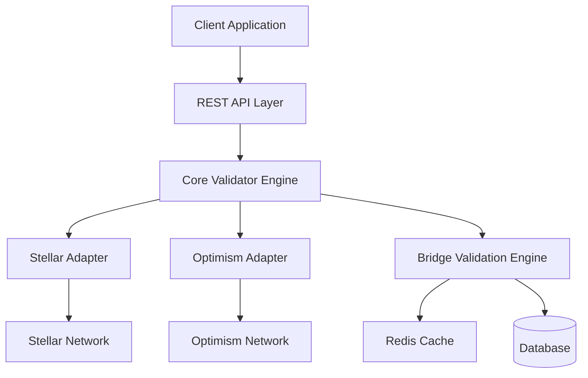

# Architecture Overview 🏗️

> **⚡ WAVE OPPORTUNITY**: Help us complete the architecture documentation! Perfect for Medium/High complexity Wave contributions.

## System Architecture

The Blockchain Bridge Validator is designed as a modular, extensible system for cross-chain transaction validation.



// TODO: Convert to actual mermaid diagram
// [HELP NEEDED] - Create proper architecture diagrams

## Core Components

### 1. API Layer (`src/api/`)

Handles HTTP requests and response formatting.

```typescript
// TODO: Add API layer architecture details
// [HELP NEEDED] - Document middleware, routing, and error handling
```

**Responsibilities:**
- Request validation and sanitization
- Authentication and rate limiting
- Response serialization
- // TODO: Add more API responsibilities

### 2. Validator Engine (`src/validators/`)

Core business logic for transaction validation.

```typescript
interface IValidator {
  validateTransaction(params: ValidationParams): Promise<ValidationResult>;
  // TODO: Add complete interface definition
  // [HELP NEEDED] - Document all validator methods
}
```

**Key Features:**
- Pluggable network adapters
- Configurable validation rules
- Result caching
- // TODO: Add more validator features

### 3. Network Adapters (`src/networks/`)

Abstract network-specific implementations.

#### Stellar Adapter

```typescript
export class StellarAdapter implements INetworkAdapter {
  async getTransaction(hash: string): Promise<StellarTransaction> {
    // TODO: Implement Stellar transaction fetching
    // [HELP NEEDED] - Add complete Stellar integration
  }

  async validateSignature(tx: StellarTransaction): Promise<boolean> {
    // TODO: Add signature validation
  }
}
```

#### Optimism Adapter

```typescript
export class OptimismAdapter implements INetworkAdapter {
  // TODO: Implement Optimism adapter
  // [HELP NEEDED] - Add L2-specific validation logic
}
```

### 4. Bridge Engine (`src/bridge/`)

Handles cross-chain validation logic.

```typescript
interface IBridgeEngine {
  validateBridge(params: BridgeParams): Promise<BridgeResult>;
  // TODO: Add bridge validation methods
  // [HELP NEEDED] - Document cross-chain validation flow
}
```

**Components:**
- Merkle proof verification
- Cross-chain state synchronization
- Bridge contract integration
- // TODO: Add more bridge components

## Data Flow

### 1. Transaction Validation Flow

```
Request → API → Validator → Network Adapter → Blockchain
                     ↓
Response ← API ← Validator ← Network Adapter ← Blockchain
```

**Detailed Steps:**
1. Client sends validation request
2. API layer validates input parameters
3. // TODO: Add complete flow documentation
4. // [HELP NEEDED] - Document each step in detail

### 2. Bridge Validation Flow

```typescript
// TODO: Add bridge validation flow
// [HELP NEEDED] - Document cross-chain validation process
```

### 3. Caching Strategy

```typescript
// Cache key generation
function generateCacheKey(network: string, hash: string): string {
  // TODO: Implement cache key generation
  // [HELP NEEDED] - Add cache invalidation strategy
}
```

## Database Schema

### Transaction Cache

```sql
-- TODO: Add database schema
-- [HELP NEEDED] - Design complete database structure

CREATE TABLE transactions (
  id SERIAL PRIMARY KEY,
  hash VARCHAR(64) NOT NULL,
  network VARCHAR(20) NOT NULL,
  -- Add more columns
);
```

### Bridge Operations

```sql
-- TODO: Add bridge operations table
-- [HELP NEEDED] - Design bridge tracking schema
```

## Configuration System

### Environment-based Configuration

```typescript
interface Config {
  stellar: StellarConfig;
  optimism: OptimismConfig;
  cache: CacheConfig;
  // TODO: Add complete configuration interface
  // [HELP NEEDED] - Document all configuration options
}
```

### Network Configurations

```typescript
interface NetworkConfig {
  rpcUrl: string;
  timeout: number;
  retryAttempts: number;
  // TODO: Add network-specific configuration
}
```

## Security Architecture

### Input Validation

```typescript
// TODO: Add input validation architecture
// [HELP NEEDED] - Document security measures and validation rules
```

### Rate Limiting

```typescript
// TODO: Add rate limiting implementation
// [HELP NEEDED] - Document rate limiting strategy
```

### Authentication

```typescript
// TODO: Add authentication system design
// [HELP NEEDED] - Document API key management
```

## Performance Considerations

### Caching Strategy

**Cache Layers:**
1. **L1 Cache**: In-memory LRU cache for frequently accessed data
2. **L2 Cache**: Redis for shared cache across instances
3. // TODO: Add more cache layers

**Cache Policies:**
- Transaction results: TTL 1 hour
- Network status: TTL 5 minutes
- // TODO: Add complete cache policy documentation
- // [HELP NEEDED] - Optimize cache TTL values

### Connection Pooling

```typescript
// TODO: Add connection pooling architecture
// [HELP NEEDED] - Document optimal pool sizes and strategies
```

### Async Processing

```typescript
// TODO: Add async processing design
// [HELP NEEDED] - Document job queues and background processing
```

## Monitoring and Observability

### Metrics Collection

```typescript
interface Metrics {
  validationLatency: number;
  networkErrors: number;
  cacheHitRatio: number;
  // TODO: Add comprehensive metrics
  // [HELP NEEDED] - Define monitoring requirements
}
```

### Logging Strategy

```typescript
// TODO: Add logging architecture
// [HELP NEEDED] - Document log levels and structured logging
```

### Health Checks

```typescript
// TODO: Add health check implementation
// [HELP NEEDED] - Define health check endpoints
```

## Testing Architecture

### Unit Testing Strategy

```typescript
// TODO: Add testing architecture
// [HELP NEEDED] - Document mocking strategies and test structure
```

### Integration Testing

```typescript
// TODO: Add integration test design
// [HELP NEEDED] - Document test data management
```

### Load Testing

```typescript
// TODO: Add load testing architecture
// [HELP NEEDED] - Define performance benchmarks
```

## Deployment Architecture

### Container Strategy

```dockerfile
# TODO: Add Dockerfile
# [HELP NEEDED] - Optimize container configuration
```

### Kubernetes Deployment

```yaml
# TODO: Add Kubernetes manifests
# [HELP NEEDED] - Design scalable deployment strategy
```

### CI/CD Pipeline

```yaml
# TODO: Add CI/CD configuration
# [HELP NEEDED] - Define deployment pipeline stages
```

## Scalability Considerations

### Horizontal Scaling

// TODO: Add horizontal scaling strategy
// [HELP NEEDED] - Document load balancing and service discovery

### Database Scaling

// TODO: Add database scaling approach
// [HELP NEEDED] - Design read replica and sharding strategy

### Network Optimization

// TODO: Add network optimization techniques
// [HELP NEEDED] - Document CDN and edge caching strategies

## Extension Points

### Adding New Networks

```typescript
// TODO: Add network extension guide
// [HELP NEEDED] - Document plugin architecture for new chains
```

### Custom Validation Rules

```typescript
// TODO: Add custom validation extension points
// [HELP NEEDED] - Design validation plugin system
```

### Bridge Protocol Extensions

```typescript
// TODO: Add bridge protocol extension architecture
// [HELP NEEDED] - Document new bridge protocol integration
```

---

**Architecture contributors needed!** This documentation has many opportunities for Wave Program contributors to add detailed technical documentation. Check GitHub issues for specific architecture tasks! 🏗️